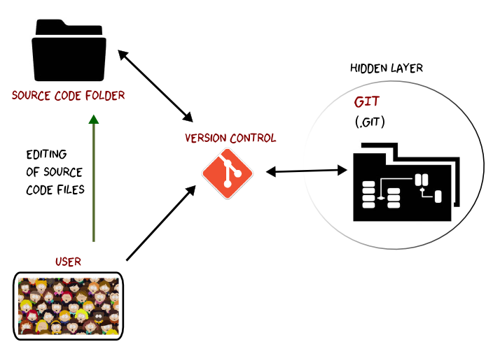
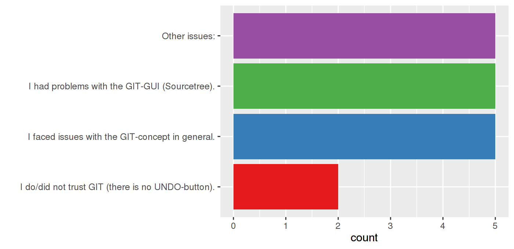

# git: introduction and local usage (part I)
##
 

**january 2016**

## recap section IT-guidelines

IT rules with the aim of:

* improve project documentation
* reproducibility of written code
* facilitate work in a group
* improve long term project efficiency


# structure
* why version control?
* A bit of git under the hood
* installing git
* starting with git
* simple example
* where to git what
* links and references
* outlook

# why version control?
##
a long-lasting project has:

* different people working on it
* many project stages and program versions
* a lot of changes on the way of getting there

**a version control system traces all these steps (changes, versions, people) in your project history**

## version control
* no longer hundreds of file versions with non-informative names
* documentation of projects for passing projects between persons / transferring it
* common tool for transparent and sustainable work flow (development)
* increase efficiency for group work

## why git
* it's free (open)
* distributed system
* non-linear development
* saves project history
* very popular, also because of GitHub
* cross platform
* especially intended for group work

## evolution of version control systems


# a bit of git under the hood
## what git can do
* trace your work steps in a project
* regeneration of past work
* particularly useful in coding (pure ASCII  or text files)
* merging work done independently

## what git cannot do
* you still have to document the code
* magically solve everything
* no backup system

##


##


# take-home lessons

* git tracks work steps
* git comments changes
* git has to be used correctly!

# installing git
##

Windows

* git comes with one of the git GUIs
* [sourcetree](https://www.sourcetreeapp.com/) for a powerful GUI
    * change language to English after installation
    * edit your personal information (both within sourcetree)


##
linux

* deb-based:

```bash
sudo apt-get install git-all
```

* rpm-based:

```bash
sudo yum install git-all
```

##


##


# starting with git
## basic commands
* overview of basic command needed in everyday usage
* good wrap-up on the cheat-sheet
* GUIs call those original commands for you
* you can also use them directly on the command line

```bash
git add example.R
```

## learning to talk git

* initiate a git repository **[init]**
* watching files (within this repo) **[add]**
* making a snapshot (commenting changes) **[commit]**
* undo changes (reverse add-command) **[reset]**
* parallel developing **[branch]**
* moving around in time **[checkout]**
* joining finished work steps (different branches) **[merge]**

# example
## setup

We reproduce the given example that has 4 individual commits. User your favorite __text
editor__ and __sourcetree__ for all exercises.

## first commit

Within a folder under git version control, create a file "print.txt" with the content
```python
print "hello"
```
and commit the changes to the local repository.

## second commit

Edit the file "print.txt", change the statement to
```python
print "hello world"
```
and commit the changes to the repository.

## third commit

Inside the same folder, create a second file named "bruno.txt" with the content
```python
print "hello bruno"
```
and commit the changes to the repository.

## fourth commit

Put the content of file "bruno.txt" into the file "print.txt".
```python
print "hello world"
print "hello bruno"
```
Delete the empty file "bruno.txt" and commit the changes to the repository.

# where to git what

* example 1 (manual version control, running numbers, dates)
* example 2 (version control by topic (paper, agu, egu, phd day ...)

    1. __identify__ your master
    2. __copy__ it to a new folder (i.e. 'code')
    3. __use__ this new folder as git-repository

* ask for advice / recommendations for first steps

# commits and commit messages
## when to commit

* What is it worth committing?
* How often do we commit?
	* The #1 rule in git-land is: COMMIT EARLY, COMMIT OFTEN.
* ...

## commit messages ([style](http://tbaggery.com/2008/04/19/a-note-about-git-commit-messages.html))

1. Subject (very first line)
    * Capitalized, short (50 chars or less) summary followed by a blank line
2. Body (wrapped in 72 characters or less)
    * Detailed description (see next slide)

## commit messages ([content](http://who-t.blogspot.de/2009/12/on-commit-messages.html))

* Why is it necessary? It may fix a bug, it may add a feature, it may improve performance, reliability, stability or a change for the sake of correctness.
* How does it address the issue? (High level description)
* What effects does the patch change? (benchmarks, side effects, etc.)

# links and references

## local section support
* stefan (2821)
* marvin (1599)
* knut (1537)
* matthias 1513)
* daniel (1521)

## tutorials / help

* [official git book](http://git-scm.com/book/en/v2)
* [basic usage tutorial](http://marklodato.github.io/visual-git-guide/index-en.html)
* [git ready](http://gitready.com/)
* [getting started and more](https://www.atlassian.com/git/tutorials/setting-up-a-repository)
* [Comparing git/vc Workflows](https://www.atlassian.com/git/tutorials/comparing-workflows)
* [Git Cheat sheet in german](http://www.xtreme-software.ch/files/Git%20lernen%20mit%20Beispielen.pdf)
* [Git Cheat sheet in english](https://training.github.com/kit/downloads/github-git-cheat-sheet.pdf)

## tutorials / help (cont.)
* [sourcetree](https://www.sourcetreeapp.com/)
* [one sourcetree guide](https://github.com/GSoft-SharePoint/Dynamite/wiki/Git-step-by-step:-Part-1)
* [git](http://git-scm.com/downloads)
* [interactice figure git](http://ndpsoftware.com/git-cheatsheet.html)
* [torgit](https://tortoisegit.org/download/)
* [github](https://desktop.github.com/ "GitHub Desktop")
* [vc video on youtube](https://www.youtube.com/watch?v=M-O8ZNW9icQ)


# outlook to second session

* advanced git: merge, branch, tag, ..
* from local to remote
* collaboration with git and GFZ gitLab

# Feedback request
## How often did you use GIT after the introduction?

1. Never, because I didn't work with files GIT is supposed to be used for (scripts, source code, ASCII files, etc...)
2. Never but for another reason (please write here why).
3. In the beginning a bit, then I lost it.
4. On a regular basis.


## Do you think GIT could assist you with your personal workflow?

1. No, it is too confusing and makes everything just more complicated than it already is.
2. Yes, but I don't understand how to properly implement it into my way of working.
3. Yes, I already incorporated it successfully into my workflow.


## What kind of topic did you use GIT for?

1. I played around, nothing specific.
2. I worked on a small personal code project.
3. I used it for the project I am currently working on.
4. I did team coding with other section members.


## What kind of problems did you encounter?

1. I had problems with the GIT-GUI (Sourcetree).
2. I faced issues with the GIT-concept in general.
3. I do/did not trust GIT (there is no UNDO-button).


## What would you need to improve your GIT experience

1. A deeper insight into Sourcetree.
2. More practical oriented examples.
3. Covering more advanced functions of GIT.
4. Something else (please write here what)


# Feedback __results__
## How often did you use GIT after the introduction?


## Comments I

*  Emergency report -> later
*  No need up to now
*  I was on a field trip
*  I did not start a new coding project
*  I didn't work with files useful for git
*  No time and no new work
*  I didn't work with files for further development

## Do you think GIT could assist you with your personal workflow?


## Comments II

*  There was no opportunity to use it up to now
*  No, my workflow is ok, with or without it

## What kind of topic did you use GIT for?


## What kind of problems did you encounter?



## Comments IIII

*  I forgot to use it
*  Change commit comments later on
*  I did not know anything about git (was not present)
*  When to branch or not to branch
*  I just didn't need it

## What would you need to improve your GIT experience?


## Comments IIIII

*  Collaboration / server
*  Team coding
*  Might use it when I start programming
*  A test case
*  Team work (text documents, latex)
*  Time

# Plan of action 

## Results from the gg-spam
 " ... describe for what you want to learn more about GIT?"

* 18 people responded
* Topics:
    * advanced git features
    * team coding
    * git and word
    * ...

## Workshop 2- Advanced git features

* topics
    * highlight git benefits
    * recap about the git concept
    * advanced git features 
    * a more sophisticated example
* target group
    *  __everybody__ in the section working with a scripting (R, Matlab, ...) and/or
     programming (C, Fortran, ...) language

## Workshop 2- Advanced git features

* date
    * via doodle (see mail or scan qr-code)


## Workshop 3- Team coding in git

* topics
    * distributed code development using git
    * intro to the GFZ  gitlab server
    * using the same code on different machines (local, hpc-glic, ...)
* target group
    *  __everybody__ in the section working with a scripting (R, Matlab, ...) and/or
    programming (C, Fortran, ...) language
* date 
    * via doodle 


# why version control?

##
at the beginning, a version control system ...

* ... traces all changes  in your project
* ... allows to go back in time easily 
* ... provides tools to compare different versions
* ... can help you to clean the mess in your source code folder 
* ... __helps__ you to document your changes 

and later  ... 

* ... makes it easy to develop code with in a group
* ... makes it easy to share code across different machines

##


## what git cannot do
* you still have to document the code
* magically solve everything (e.g. merging of branches)
* no backup system

##


# Potential rules for the section

## git should be used ...

* ... for code with __two or more__ developers 
* ... for code and software that is considered as a general tool for the working group
* ... for all new Projects / PhDs / staff from the very beginning 

Recommendations:

* ... for the process of a publication (figures and analysis, data preparation) 

# Workshop 3 : Team coding

# Distributed development with GIT

## Recap

1. Basics of version control (e.g. GIT)
2. Basics of branching
3. __Distributed code development__  and resolving merge conflicts

## Outline

* Concepts
* Simple example using Gitlab at GFZ
* Additional features and general hints

## What you will learn

* how to extend local git repositories to work in a team
* git locally vs git on a server
* how to set up
* how to interact

# Concept ... 
## ... or what is distributed code development

* code or project  is hosted by a central GIT server
    + internal GFZ (GITLAB)
    + external providers (GITHUB, BITBUCKET, GITLAB, ...)
    + both at the same time

* every local working copy __might__ have the full history of the project
    + Network access is not required to browse the history


##


# GitLab

## create a new repository

* login on [git.gfz-potsdam.de](https://git.gfz-potsdam.de)
* create new repository
* choose "private"
* manually add group members (probably all master)
* OR create a group that owns the repositories

## local creation vs server creation

a shared git repository can evolve in 3 ways:

* local folder $\rightarrow$ git folder $\rightarrow$ create server repository $\rightarrow$ link local folder to server copy
* create server repository and "download" (pull) as new empty local copy
* "download" (pull) an existing server git repository to start working on it locally

## intern vs. extern

there are 2 gitlab strucutres:

* intern = accessible within GFZ network (for employes)
* extern = for cooperating with extern project partners

# Extras

## Additional features of GIT-webinterfaces

* [issues](https://git.gfz-potsdam.de/mreich/gitIntro/issues/3)
* [wiki](https://git.gfz-potsdam.de/damage_group/damage_data/wikis/home)
* [activity (graphs)](https://git.gfz-potsdam.de/damage_group/damage_data/graphs/master)
* [notifications (RSS, Mail) on commits,
  etc.](https://git.gfz-potsdam.de/damage_group/damage_data)
* comments on code
* continuous integration

## Workflow recommendations

* commit messages
* commit / push frequency
* coding practices (contribution guidelines)
	* tab
	* spaces
	* commenting style
	* indent
	* linter
* readme file for gitlab
* common branch naming (bugfix, features, etc.)


