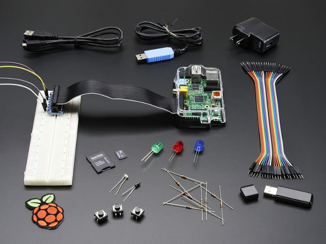
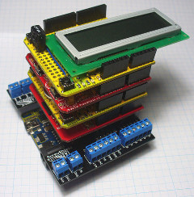
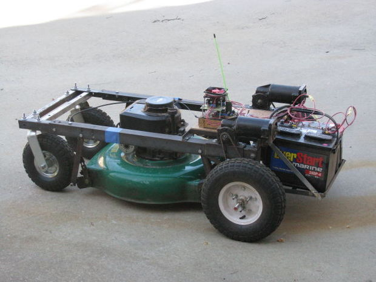
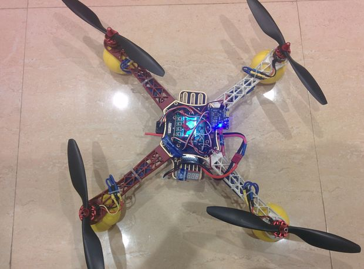
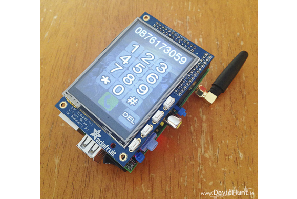
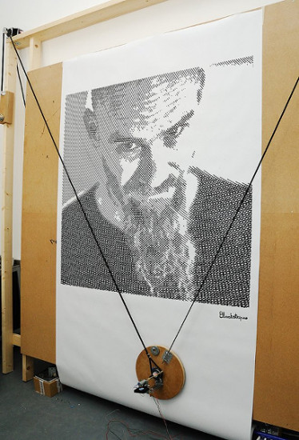
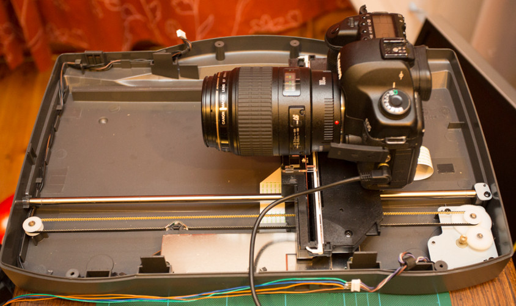
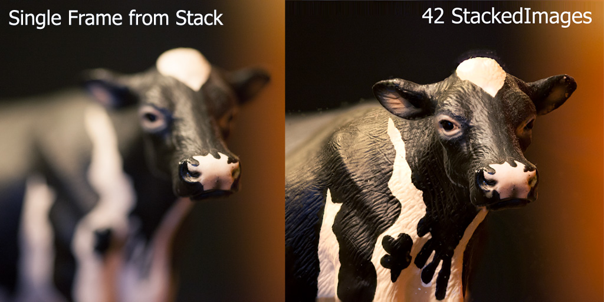
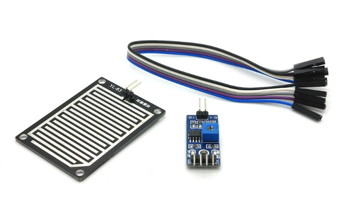
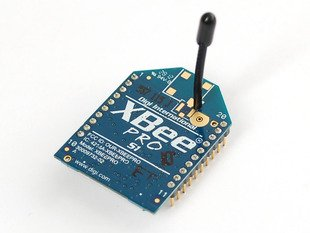

# Arduino & Raspberry Pi

 

Marvin Reich

**Summerretreat 2015**

# structure

* history & facts
* what to know first
* what do you need?
* what can you do with it?
* approaching a project idea
* ..so what is possible?
* pi stuff
* your project ideas / brainstorming
* where to start..?

# history & facts

## arduino

* started in 2005
* project for students at *Interaction Design Institute Ivrea* (Italy)
* the idea was to design a easy-to-use computer for a non-technical-audience
* sold over 50000 in just 2 years
* name comes from a bar where founders often met

## raspberry pi

* started in 2009
* initiative from charity foundation, later called "raspberry pi foundation"
* idea of giving children a cheap hardware tool for experimentating and educating the "new generation" in computer hardware
* model B sold over 2 million in just 2 years

## so what is the idea..?

..to give the new generation and interested people cheap hardware in order to:

* get in touch with hardware again
* actually DO something with it
* have cheap equipment so fear ceases in experimentating
* build a flexible platform for infinite options
* push on creativism, thinking of future IT solutions and "new ways of hardware"

## tecnical specifications

|                  | raspberry pi 2 | arduino uno |
|:----------------:|:--------------:|:-----------:|
|       chip       | ARM7 Q 900 Mhz | ATmega 328P |
|     USB ports    |        4       |      no     |
|       HDMI       |       yes      |      no     |
|     ethernet     |       yes      |      no     |
|   flash memory   |  micro sd slot |    32 KB    |
|        RAM       |       1GB      |     2 KB    |
| digital I/O pins |        15      |      14     |
|    analog pins   |        2       |      6      |

# what to know first

## software

a software (program) tells the computer what to do

there are different languages to write software

* the computer understands machine code
* this is why compiling is necessary

languages close to machine code:

* cobol, fortran, c

languages using other languages to simplify coding for end-user:

* R, matlab, html, ... , maaany more

## electronics

a computer understangs only **0** and **1**

* 1 bit is 0 or 1
* 8 bit = 01000010 = 1 byte
* 1 byte permits the values of 0 to 255
* 1 byte  is the space needed to store one character 
* important for analog signals

## why these examples?

because:

* you might need to code close to hardware
* you might get involved in how "raw" data is passed on

for sure is that

* you will get much more in touch with hardware
* some projects are so individual that you really have to "build your own solutions"

starting with and revising basic knowledge is important and will definitely help 

# what do you need?

## basic

* microcontroller
* power supply
* storage medium
* computer for operating the microcontroller
* sensors / units to connect
* program (code) to do what you want

## advanced

* multimeter
* flush cutter
* wire stripper
* soldering iron
* breadboard
* maany cables

## software: arduino

## software: raspberry pi

* operating system
* usual stuff for programming

operating sytems:

* raspbian
* ubuntu mate
* snappy ubuntu core
* windows 10
* OSMC (media center)
* RISC OS

## hardware

basically you can use all sensors and parts on both devices!!

BUT..

## shields

to connect (external) hardware, both boards provide the possibility to use so called *shields*

* pre-build circuit boards
* easily plugged-in onto the microcontroller

they provide additional capacities like:

* controlling motors
* provide communication (internet, cellular, wireless)
* connect LCD-screens
* connect cameras
* connect sensors
* ..much more!

# what can you do with it?

## arduino vs. pi

there are things you can do with both boards
BUT each one have their speciality

then there are things you cannot realize with both

the bigger the project, the more probable that you will need to combine both boards

..**y is that?**

## arduino

* pure microcontroller
* low power requirement
* small in size (exists even in tiny)
* no (not much) internal storage
* perfect to connect sensors, both digital and analog

## typical tasks: arduino

* robotik
* sensor technologies
* client / server for data transfers (UMTS, radio transmitters)

## raspberry pi

* more a computer than a typical microcontroller
* possibility to connect sensors
* can accomplish all tasks of a "normal" computer
* very flexible storage
* fast and more powerful processor

## typical tasks: pi

* webserver
* cloud
* database
* media center
* file sharing
* sensor technologies

# approaching a project idea

## structure

1. figure out what you want to do
2. check what hardware best fits your needs
3. look on the web for similar projects
4. buy the hardware and connect it
5. decide on the language(s) to use (pi)
6. install drivers and libraries
7. make first tests
8. start with a minimized setup and get more complex

when it all works well:

9. build an individualized circuit board
10. build apropiated casing

## what you should have in mind

* power supply
* storage needed: internal, external, database, data transmission
* libraries: there is always more than just one
* can i do everything with just one microcontroller?
* if you buy cheap hardware, buy more at once!
* degrees of freedom (individuality) vs. guaranteed project success

# ..so what is possible?

## arduino & pi

## arduino kit

## pi kit

## shields

## microbot

## smiling plant

## lawnmower

## drone

## piphone

## painter pi

## photo focus stacking I

## photo focus stacking II

# pi stuff

## setup

* headless vs. complete
* active vs. passive
* hidden vs. interactive
* internal network vs. internet

## webserver

* apache: complete, big, lots of help
* nginx: small, basic, stable
* lighttpd: even smaller, stable, widely used

## data storage

* "internal" (sd card slot)
* external usb

regular folder structures vs. database

* posgres: complete, big, slow
* sqlite: quite standard, easy, lots of help
* node (mongo db)

## cloud

* owncloud
* seafile
* syncthing
* bittorrent sync

## music

* music player deamon (mpd)
* airplay
* pi musicbox

# your project ideas / brainstorming

## requests

* tipping buckets / rain gauges
* meteo sensors
* webserver
* webbrowser
* radio communication
* ...

now: **BRAINSTORMING**

## meteo: rain

[semi professional electrical rain sensor](http://rainsensors.com/)

[self build rain gauge: arduino](http://www.instructables.com/id/Arduino-Weather-Station-Part3-Rain/?ALLSTEPS)

## radio communication

cheap, basic	---	expensive, intelligent

# where to start..?

## hardware

* [pollin](https://www.pollin.de)
* [reichelt](https://www.reichelt.de)
* [watterott](https://www.watterott.com)
* [adafruit](https://www.adafruit.com)
* [seeed](https://www.seeedstudio.com)
* [fritzing: circuit board design](http://fritzing.org/home/)

## software

* [arduino ide](https://www.arduino.cc/en/Main/Software)
* [pi operating system images](https://www.raspberrypi.org/downloads/)
* driver for many hardware on (arduino & pi) [github](https://www.github.com)

## tutorials arduino

* [tronixstuff](http://tronixstuff.com/tutorials/)
* [sparkfun](https://learn.sparkfun.com/tutorials/what-is-an-arduino)
* [adafruit](https://learn.adafruit.com/category/learn-arduino)
* [instructables](http://www.instructables.com)

## tutorials raspberry pi

* [jan karres](http://jankarres.de/uebersicht-aller-raspberry-pi-artikel/)
* [development-blog](https://developer-blog.net)
* [instructables](http://www.instructables.com)
