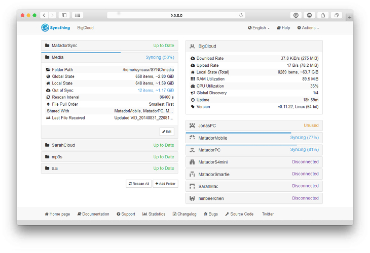

# pandoc

universal document converter
converts from easy-to-write markdown, latex, html, docx (and more) to various file formats, like

* tex
* latex beamer
* docx, odt
* html
* pdf
* ebooks
* and many more!

[pandoc website](https://www.pandoc.org)

(for windows, mac & linux)

# little internet security

## 

extention for brower (pc & smartphone)

automatic forward to secure websites, if they exist

download using add-ons of your browser or [here](https://www.eff.org/de/https-everywhere)

## 

firefox-extention which blocks active content like

* javascript
* java-applets
* flash
* microsoft silverlight

blocking policies adjustable by user

useful especiall as well for getting an idea of who want to retrieve information when visiting whatever website

(what is the interest of facebook in my orders at conrad!?!)

[project website](https://noscript.net/)

## 

routes ALL (if desired) connections over tor-nodes

a request is redirected over sufficient, privately provided nodes in order to make it (almost) impossible to be identified

as a consequence you can really ensure anonymity while surfing the web

useful for:

* people living under restrictive governments
* people who want to protect their privacy
* journalist, bloggers

versions

* standalone browser for pc (tor-browser)
* all-connection solution for smartphones (orbot)

[project website](https://www.torproject.org/)

## Tor video

# personal cloud: syncthing

[syncthing website](https://syncthing.net/)

[syncthing git repository](https://github.com/syncthing/syncthing)
