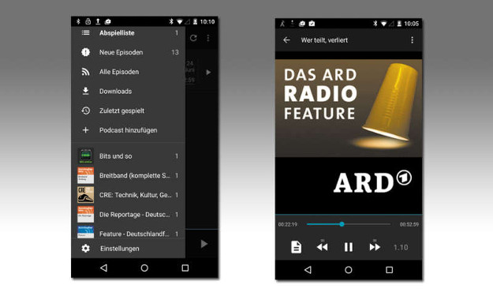
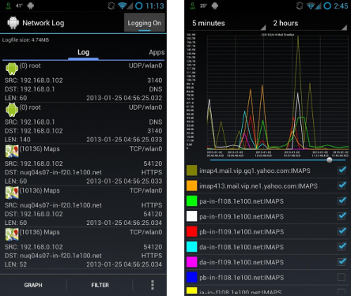

# write emails from commandline (thus from everywhere)

sSMTP

brilliant for configuring certain triggers in your OS, where you want to be notified via mail

*  works great for data loggers and logging systems as notifications (e.g. thresholds, etc.)
* it's as simple as:

'echo "this is mail body" | mail -s "Subject" username@somedomain.com'

[linux](https://github.com/ajwans/sSMTP)
[windows](http://unixmail-w32.sourceforge.net/)
[ios](https://github.com/ajwans/sSMTP)

# phone utils

## 

 sync your data  from phone / tablet / laptop

* bookmarks
* history
* preferences
* passwords
* add-ons
* open tabs (!)

download in firefox add-ons

## antennaPod

small, smoothly working app to store, download, mananage and listen to podcasts

<!---->
[website](https://www.antennapod.org)
[github](https://github.com/AntennaPod/AntennaPod)

## network log

 watch and log  all network activity on your phone

<!---->
[f-droid store](https://f-droid.org/repository/browse/?fdid=com.googlecode.networklog)
[github](https://github.com/pragma-/networklog/)

# little smartphone security

## what you can do

smartphones are daily used by almost everyone (in germany) BUT people have NO IDEA what their phone really does..
..this is and will be critical as more and more activities are shifted to carry out with a smartphone (banking, paying, tickets, etc.)

custom ROMs (operating systems from cell phone company):

* blocks the user out (not granting all rights completely control phone)
* are not updated for old phones, thus leaving doors for intruders wide open

 there are working alternatives !! 

* root your phone (gives access to other types of apps)
* install an alternative operating system
* actively control phone network activity

## alternatives

app store: [f-droid](https://f-droid.org)

whatsapp: [threema](https://threema.ch/), [chatsecure](https://chatsecure.org/), [signal](https://whispersystems.org/), [conversations](https://f-droid.org/repository/browse/?fdid=eu.siacs.conversations)

operating systems: [cyanogenmod](http://www.cyanogenmod.org/), [sailfish OS](https://sailfishos.org/), [OmniRom](https://omnirom.org/), [MIUI](http://en.miui.com/)

network activity: [AFWall+](https://f-droid.org/repository/browse/?fdid=dev.ukanth.ufirewall)

