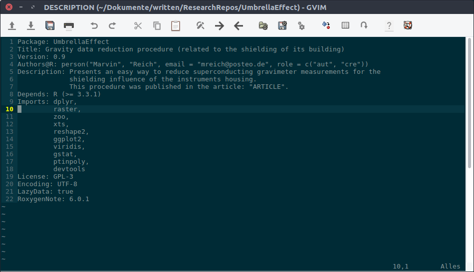

# Writing R packages
## 

SUMMERRETREAT 2017

Marvin Reich

## why?

there are a lot of good reason why you should write your own R package:

* document your own code
* force yourself to keep your own code organized with a certain structure
* share code with other
* easily transfer parts of your publication-analysis-methods with interested scientists so your methods can be applied easily

## what do I need?

not much actually: 

* devtools
* roxygen2
* github account (optional)

## what is the best approach to write an R package

having in mind the reasons / goals for writing packages,
i think the most important advice is: JUST GET STARTED !

* playing around a little (like today) to get confidence
* start maybe with documenting your functions
* then one comes to the other...

when you have some experience and commited some errors,
you will much more likely be able to construct a "big project" rather than thinking
in your first steps everything to be already perfect

# basic structure of an R package
## 

there are actually only 2 things you need for a minimalistic package:

* a DESCRIPTION file
* a folder called 'R' for the code

if you have ever unzipped a CRAN R package, you might remember a stucture like the following

## DESCRIPTION file

## create empty package structure

you can easily create a template package structure from within R

just set the correct working directory where you want your package folder to be created, load devtools
and use the create function

    library(devtools)
    create("PACKAGENAME")

# hands-on (1)

* 
create everything obligatory for an R package in a folder

# functions
## 

data analysis means writing code. and code you re-use quite frequently will then be (hopefully) written as a function.

when your stack of functions for your data analysis is just growing too big and everything seems an incomprehensible mess,
this is probably the most common point when people start working on a package.

functions within an R package go into the 'R' folder.
there can be one file per function or you can put all one file for all functions or whatever you want in between.

## writing & comments

at this point, before just copy-pasting all these functions into your package, think of some standards,
you might want to keep straight troughout your package.

* your own naming convention for functions (e.g. always start with small letters, separate with _, etc.)
* variable naming within your functions (e.g. if you often use soil moisture, decide for one naming throughout all mentioning; not SM, soilM, theta, etc.)
* .. ?
* call other functions using packagename::functionname()

also decide on commenting:

* always above, always at the end of the line
* hierarchical structure of classifying comments
* 

most of these things can be taken care of with and are controlled by a linter

## sticking help file documentation to functions

no matter how you organized your functions in your 'R' folder, its quite handy that you can stick all the information about a functions help, 
right new to the function code itself.
this way you keep code and documentation close together and hopefully directly modify one if the other has changed.

there is a special type of header where you include all the information for the help file.
just place it right above your function code and start filling it.

    #'title short title
    #'
    #' @description describe what exactly your function does, when can and should it be applied, when not. etc.
    #'
    #' @param parametername explanation, standards, units...
    #' 
    #' @return type of value that is given back by your function
    #' 
    #' @details some extra infos; not always necessary
    #' @references Your Name (YYYY), you@@yourhomeserver.de
    #' @examples executable examples of how to use your function;
    #' best when using data which is supplied within your own package

## use roxygen to create your help files

this package reads in all the information you included in these special tagged header above each of your function
and automatically create a help file (FunctionName.Rd) within the subfolder "man" in your package folder.

call this function every time you modified or added a functions documentation.

    library(roxygen2)
    # set correct working directory
    setwd("PATH/TO/YOUR/PACKAGEFOLDER")
    document()

# hands-on (2)

* 
write a function with documentation and let roxygen create the help files

# load, check, build, install..
## 

introduction to some useful functions of the devtools package

## load a package locally

simulates to install and load a package via 'library()'

all data in /data folder will also be loaded

    library(devtools)
    load_all("PATH/TO/YOUR/PACKAGEFOLDER")

## check

check and builds a package

this is especially necessary if you want to submit your package to CRAN,
as then there should be no errors produced by this command.

    library(devtools)
    check("PATH/TO/YOUR/PACKAGEFOLDER")

## build

transforms your package into a single file

if binary = FALSE (default) this will produce a platform independent 'tar.gz' package installation file.
if binary = TRUE, a platform dependent compressed file will be created (e.g. .zip on windows).

    library(devtools)
    build("PATH/TO/YOUR/PACKAGEFOLDER")

## install

as the name says, this will permanently install your package on your system

    library(devtools)
    install("PATH/TO/YOUR/PACKAGEFOLDER")

## release

this functions runs a couple of checks, asks you questions and then submits your package to CRAN

    library(devtools)
    release("PATH/TO/YOUR/PACKAGEFOLDER")

# hands-on (3)

* 
load your package, test your function and check out its help

# what has to be kept in mind
## 

besides the minimum package requirements,
the following covers roughly what else you might want to include into your package.

some of these need time to dive into the topic in details but
its necessity can be re-decided for every package.

this listing is not complete, please see links at the end of presenation to find the full list.

## include data

* for testing your packages functions
* distributing a dataset (e.g. table of certain research results)

depending on the use-case of the data, they are stored in different locations:

* available to user (e.g. example datasets); gets loaded by default; these datasets should be documented;
location: data/

        devtools::use_data(dataset, PACKAGENAME)

* not available to user (e.g. functions input etc.); location: R/sysdata.rda

        devtools::use_data(dataset, PACKAGENAME, internal = TRUE)

* raw data (e.g. example scripts, big datasets); location: inst/extdata; 
access raw datas file path using this code

        system.file("foldername", "filename", package = "PACKAGENAME")

## namespace

* confusing
* advanced topic
* only necessary when publishing your package

the NAMESPACE file (in your package root directory) is about imports and exports of functions

* import: needed functions from other packages
* export: make a function usable outside of your package
* is created automatically and watched over by roxygen2
* just include in function documentation using e.g.
        @export
* it's recommended to export only a minimal set of functions to avoid possible conflicts with other packages

always using PACKAGENAME::functionname() keeps you independent of these namespace issues

## vignettes

a longer, more general but detailed description of your package or a sub-process

* vignette content: original source, readable versions (HTML, PDF, etc.), file of R code
* look at vignettes of a specific package: ´browseVignettes("PACKAGENAME")´
* you can use a vignette engine to create them easily using markdown: [knitr](https://yihui.name/knitr/)

usage and workflow within devtools packages:

    devtools::use_vignette("vignetteNAME")

1. creates vignettes/ directory
2. addas dependencies to DESCRIPTION file
3. create draft vignette in vignettes/vignetteNAME.Rmd

now you only have to

1. modify it
2. knit it again to convert it to readable output

## tests

just quick repeat: why testing again?

..fewer bugs, better code structure, robuster code..

set up package testing:

    devtools::use_testthat()

1. creates tests/testthat directory
2. includes testthat package in DESCRIPTION file
3. creates tests/testthat.R file, which runs when you check your package

now your good to go:

* write tests (name has to start with 'test')
* store them in the tests/testthat folder
* test your package using

        devtools::test()

## license

defines WHO can do WHAT with your code

* only really important if you want to publish your package
* is stated in a file LICENSE within your package root directory
* is referenced to in the DESCRIPTION file
* don't underestimate this topic and to some research !
* suitable for R-packages are: MIT, GPL-2/3, CC0
* if you include code you didn't write yourself, check that this is okay with its license !

a good start and overview can be found [here](http://choosealicense.com/licenses/) and [here](https://tldrlegal.com/)

## citing R packages

writing, pubishing and therefore also citing software and code used within ones analysis gains more and more attention

* if you want to release a package along a publication, give the end-user an easy way how to cite your software

* find out how to cite a package using:

        citation("PACKAGENAME")

* these information is given in the CITATION file, which should be located in inst/
* CITATION file contains: header, bibtext-like entry, footer

# publicating your package
## 

sharing your package is advantageous, because:

* collegues, project partners can re-use your functions
* you can install them directly on any new machine or machine your are temporarily or spontaneously working
* functions / anaylsis done for a publication can be actually and easily used by scientist interested in your findings

code published along a paper will increase the possible usage and validation of your scientif method

## CRAN

CRAN = Comprehensive R Archive Network, is the main R package repository

* this means, there are quality checks
* you are limited in the [choice of license](https://svn.r-project.org/R/trunk/share/licenses/license.db)

to submit your package there are basically just 3 steps:

* the following should not give any errors:

        check("PACKAGENAME")

* you have to meet [CRAN policies](http://cran.r-project.org/web/packages/policies.html)
* submit tarball on [webform](https://cran.r-project.org/submit.html)

## github

the easiest (cause fastest) way to make your package public is to just

* make a git repo out of your package folder
* write a good readme file, so people will understand what your package does,
how to install it and was requirements to meet
* commit and upload to your github account

now everyone from everywhere can install your package within R with two single lines:

    library(devtools)
    install_github('githubNickname/repositoryName')

isn't that just awesome !?

# hands-on (4)

* 
create a new git repository

* 
add your files and commit

* 
push changes to github

* 
install your package directly via github

# getting help and get started

GENERAL: 

* website & book by Hadley Wickham: [R Package](http://r-pkgs.had.co.nz/)
* [CRANs official guide](https://cran.r-project.org/doc/manuals/R-exts.html)
* [great quick guide](https://hilaryparker.com/2014/04/29/writing-an-r-package-from-scratch/)
* [also good](http://kbroman.org/pkg_primer/)

LICENCE:

* [choosealicense](http://choosealicense.com/licenses/)
* [tldrlegal](https://tldrlegal.com/)

CRAN:

* [CRAN policies](http://cran.r-project.org/web/packages/policies.html)
* [CRAN submission webform](https://cran.r-project.org/submit.html)

VIGNETTE engine:

* [knitr](https://yihui.name/knitr/)
